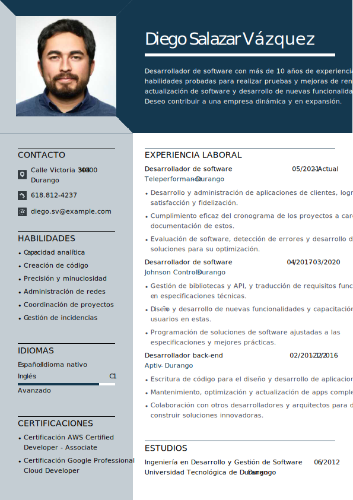

# 📄 Guía para Crear un CV de Desarrollador en TI / Guide for Creating an IT Developer CV

Un buen CV para un desarrollador en tecnología debe ser **claro, técnico y demostrar impacto real en proyectos**.  
A continuación encontrarás una descripción de las secciones recomendadas, primero en **español** y después en **inglés**.

---

## 🇪🇸 Secciones Clave en un CV de Developer

### 1. Información de Contacto
- 📧 Correo electrónico profesional  
- 🌐 LinkedIn  
- 🐙 GitHub/GitLab/Bitbucket (muy importante para mostrar código real)  
- 💻 Portfolio personal o página web  

👉 **Importancia:** Los reclutadores quieren ver tu presencia en la comunidad y ejemplos de tu trabajo.

---

### 2. Resumen Profesional
Un párrafo breve (3–5 líneas) describiendo tu rol actual, años de experiencia, tecnologías principales y logros clave.  
Ejemplo: *"Desarrollador Backend con 4 años de experiencia en Python y Node.js, especializado en arquitecturas de microservicios."*

---

### 3. Habilidades Técnicas
Lista clara, categorizada:
- **Lenguajes:** Python, JavaScript, TypeScript  
- **Frameworks:** React, Angular, Django, Spring  
- **DevOps & Cloud:** Docker, Kubernetes, AWS, Azure  
- **Bases de Datos:** MySQL, PostgreSQL, MongoDB  

👉 **Importancia:** Permite a los evaluadores hacer un "keyword match" rápido para filtrar perfiles.

---

### 4. Experiencia Profesional
Por cada empleo:
- Puesto, empresa, fechas  
- Breve descripción del rol  
- **Logros tangibles con métricas** (ej. "Reduje el tiempo de compilación en un 40%").  

👉 **Relevancia:** Demuestra resultados y tecnologías aplicadas.

---

### 5. Educación y Certificaciones
- Título universitario, bootcamps, cursos técnicos  
- Certificaciones relevantes (ej. AWS Certified, Scrum, Microsoft, Google Cloud)  

---

### 6. Proyectos Destacados
Incluye proyectos **open source, hackathons, repositorios personales**:
- [Repositorio Backend API](https://github.com/ejemplo/api-backend)  
- [Proyecto Web con React](https://github.com/ejemplo/proyecto-web)  

👉 **Importancia:** Enseña código funcional revisable.

---

### 7. Idiomas
Importante si aplicas a empresas internacionales. Ejemplo:  
- Español (nativo)  
- Inglés (avanzado, C1)  

[Ejemplo2](./assets/ejemplo2.jpg)
---
